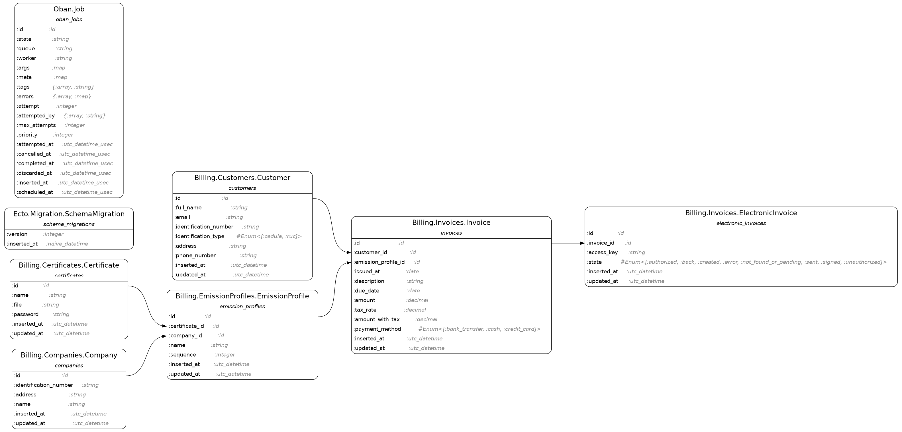

# Billing

> IMPORTANTE: El desarrollo de la aplicación  está en procesos, aún no se libera el primer reléase

Billing es una aplicación web de facturación  electrónica para Ecuador escrita [Phoenix](https://phoenixframework.org/) un framework web escrito en el lenguaje [Elixir](https://elixir-lang.org/). El desarrollo de la aplicación la he estado desarrollando en vivo transmitiendo en YouTube:

[Playlist en Youtube con el desarrollo del proyecto](https://www.youtube.com/watch?v=73sglmNSK5A&list=PLS3D8lZZio6oKttRZfuytjSgh1RGNTit7)

## Requerimientos

  * [Elixir](https://elixir-lang.org/)
  * [Erlang](https://www.erlang.org/)
  * [Postgresql](https://www.postgresql.org/)

## Levantar el proyecto en el entorno local

Clonar el repositorio localmente e ingresar a la carpeta del proyecto

    git clone https://github.com/joselo/billing
    cd billing

Instalar las dependencias del proyecto y crear la base de datos

    mix setup

Iniciar el servidor de la aplicación

    mix phx.server

Si todo ha ido correctamente visita: http://localhost:4000/

# Notas de desarrollo

El proyecto usa el API de facturación [api.taxideral.com](https://api.taxideral.com/).

## Diagrama ERB



## Requerimientos para desarrollo

Se recomienda usar [Hombrew](https://brew.sh):

Crear un archivo llamado `Brewfile` con las siguientes formulas:

```
brew "erlang"
brew "elixir"
brew "inotify-tools"
brew "postgresql@14", restart_service: :changed
brew "watchman"
```

Una vez creado el archivo `Brewfile` por ejemplo en `/tmp/Brewfile`, ejecutar el siguiente comando para instalar las formulas:

    brew bundle --file=/tmp/Brewfile

Realizada la instalacion se debe crear un super usuario en postgres:

    createuser --superuser postgres

Comprobar si podemos conectarnos a postgres:

    psql -Upostgres

### Dependencias par Debian/Ubuntu

Se recomienda tambien instalar las siguientes dependencias:

    sudo apt-get install build-essential libncurses5-dev libncursesw5-dev libssl-dev


## Licencia

Este proyecto está bajo la Licencia MIT.
Consulta el archivo [LICENSE](./LICENSE) para más detalles.

